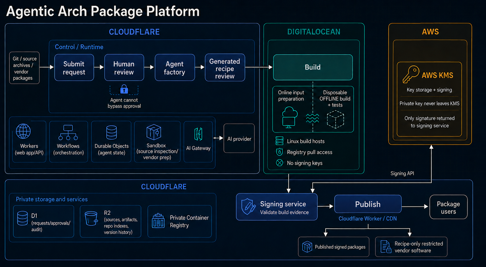
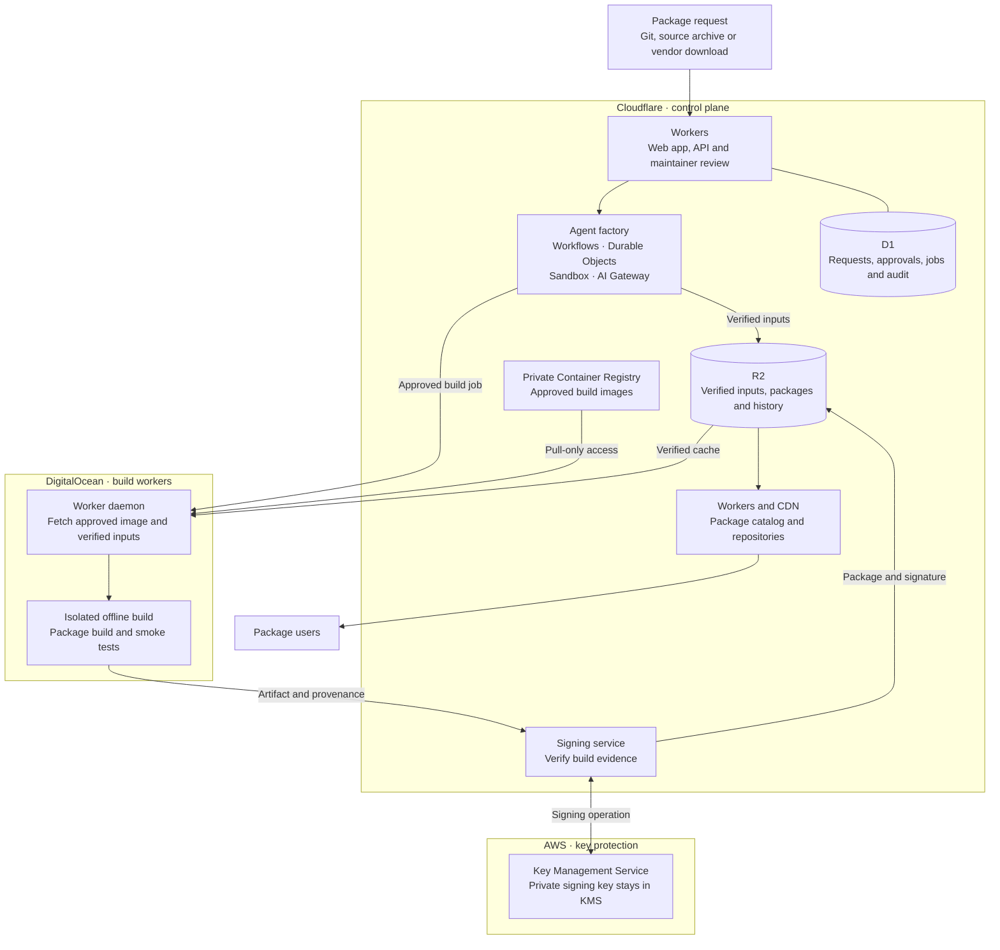

# Package platform architecture

This reference deployment uses Cloudflare for the control plane, DigitalOcean for build workers, and optional AWS KMS for signing-key protection. Workers can also run on other Linux hosts. The initial signer keeps its key in an isolated Cloudflare service; the managed KMS adapter provides a separate deployment option.

Maintainers approve requests before generation and review generated recipes before a build can start. Stable promotion is a separate decision after quarantine checks.

The public catalog serves published objects through the delivery layer. R2 remains private. Software that cannot be redistributed is published as a recipe with a pinned vendor download.

## Responsibilities

| Location | Components | Responsibility |
| --- | --- | --- |
| Cloudflare | Workers | Web interface, authentication, API, worker registration and read-only package queries |
| Cloudflare | Workflows | Durable generation, build-result processing, publication and retries |
| Cloudflare | Durable Objects | Agent execution state and coordination |
| Cloudflare | Sandbox | Isolated upstream inspection and dependency preparation |
| Cloudflare | AI Gateway | Route and observe model requests |
| Cloudflare | D1 | Requests, immutable revisions, approvals, leases, image policy and audit records |
| Cloudflare | R2 | Verified input bundles, packages, recipes, signatures, repository indexes, provenance and retained versions |
| Cloudflare | Private Container Registry | Digest-pinned build images, accessed with temporary pull credentials |
| DigitalOcean | Linux worker hosts | Prepare verified inputs, build offline and run smoke tests in disposable containers |
| AWS | KMS | Protect the private signing key and perform signing operations |

## Security boundaries

- Source inspection and build containers receive no application or signing credentials.
- Worker identity keys sign provenance. Package-signing keys remain separate.
- Signing requires the reviewed manifest, a valid worker identity and a matching artifact checksum.
- Registry credentials allow pulling images and stay outside build containers.
- AI output cannot approve itself or promote a package to stable.
